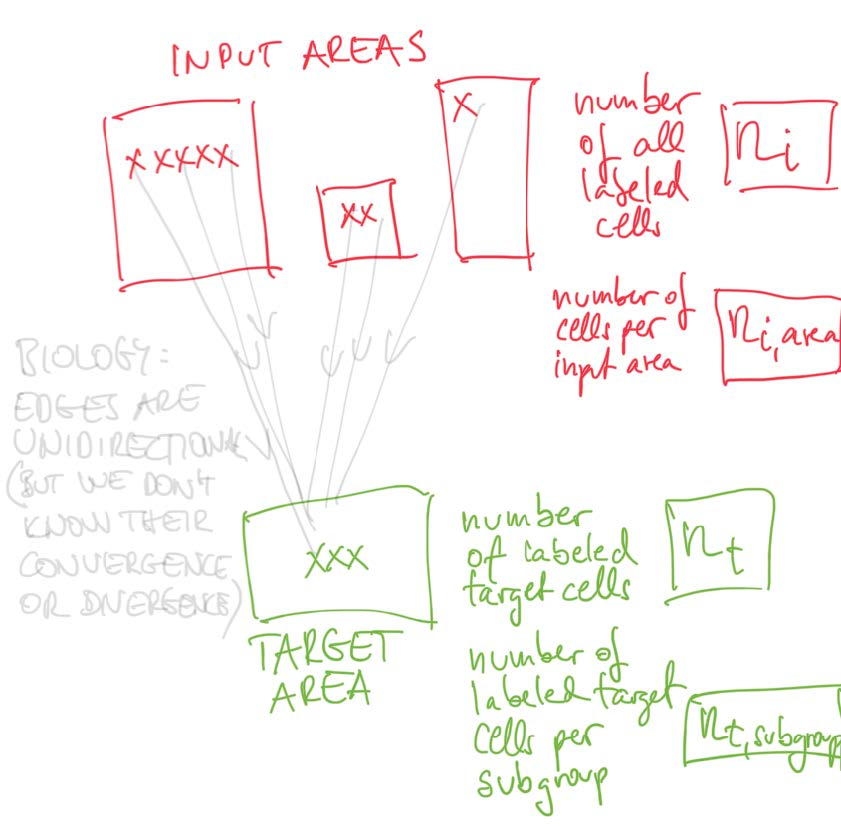
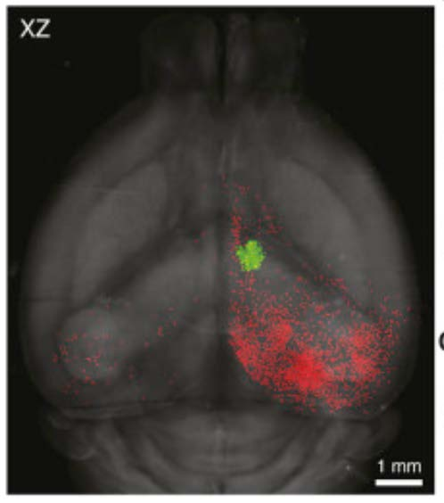
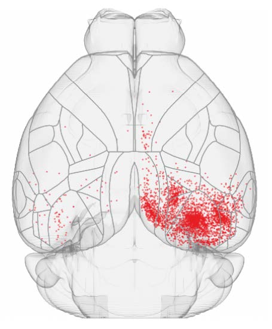

# Background

We would like you to prepare a presentation, no longer than twenty
minutes, on approaches to any of the following problems. They are all
questions that we have been asked by Crick scientists. We have given a
selection so that you can chose which best allows you to express your
talents, as we generally assign projects based on the closest match in
skills.

You're not expected to answer all of them: the first is the one
that the current staff found the most challenging, whereas the other
two are somewhat more traditional. 

If you have any difficulties or concerns, please let me know at
gavin.kelly@crick.ac.uk. We will post the responses to any questions
here, so it may be worth checking it again.

We don't expect a large body of code or slides: we'd much rather that
you consider the issues around your chosen question(s).

# Q1) Neuron Connectivity

Neurons are connected (via long, thin “wires”, called axons). One
neuron receives and sends axons from/to thousands of neurons. Here we
are exclusively labelling input cell (sender) -> target cell
(receiver) connections (unidirectional). Furthermore, as a first
approximation we assume uniform levels of divergence/convergence from
input cells to target cells.

We label neurons in a target area (let’s call them target cells and
the count of them is n<sub>target</sub>) with green colour. As a first
approximation we assume this process is random (but we have control
over how much label we inject, so we can experimentally control
n<sub>target</sub> somewhat). A transformed label (this time with a
red colour) then travels (backwards) to all the upstream connected
neurons (let’s call them input cells, n<sub>input</sub>). We then
extract the brain and count target cells and input cells by simply
counting green and red cells, respectively. There are two different
types of target area A1 and A2; and the experiment is perfomed on mice
of four different genotypes G1...4.







## The Data

[The data](Data.txt) is a tab-delimited file containing one experiment
per row: the first column labels the type of target area, followed by
a label describing the genotype; then we have the number of target and
input neurons counted in that experiment. Here's the head of the data:

|area | genotype | n_target | n_input|
|:--|:--|:--|:--|
|A1 | G1 | 1 | 2125|
|A2 | G1 | 5 | 6153|
|A1 | G2 | 9 | 2726|
|A1 | G2 | 11 | 8813|


## The Question

From a purely descriptive level, the scientist wants to know how to
describe the relationship between the n<sub>target</sub> measurements and
the corresponding n<sub>input</sub>. Initially we can ignore the
subgroups and see if we can find a good way of describing the
relationship between the target numbers and the corresponding number
of cells in the inputs. They'd then like to know if there are good
ways of parametrising this relationship and, if so, can they use these
to look at possible differences between different genotypes, or
between different target areas.

Ultimately the scientist would like to use these data to build
hypotheses regarding the connectivity between the input and target
areas. Can you think of a mechanistic model that would generate data
of this type, so that rather than a purely empirical approach, we
could start to estimate meaningful parameters about the underlying
mechanisms?


# Q2) Improving a Simplistic Analysis
Patients' susceptibility to 'flu is assessed by repeatedly diluting
serum down until a binary detection of the ability to respond to an
infection is no longer positive.  This is done both before and after
a patient has been treated with a candidate vaccine. The possible
dilution ratios start at 1:10 and are then halved 1:20 all the way to
1:1280. So if a sample passes at 1:10 and 1:20 and then fails it is
recorded as "20" etc; a fail at 1:10 is recorded as "0", and if it never
fails it is recorded as "1280".

The [R script](flu.r) below, and in the repository, recreates one
current methodolgy for summarising susceptibility per cohort.

``` R
library(tidyverse)
raw_data <- read.csv("flu.csv")
long_data <- tidyr::gather(raw_data, key="PrePost", value="titer", Before, After)
grouped_data  <- long_data %>%
  mutate(measure=ifelse(titer<10, 5, titer)) %>%
  group_by(strain, Age, Egg.Cell, PrePost) %>%
  summarise(GMT=exp(mean(log(measure))))
```
What improvements would you make to this approach.


# Q3) Experimental Design 
A scientist comes to us wanting to run an experiment on a set of
cell-lines (samples historically derived from individuals.)  Three
represent individuals who responded to therapy; four are from
individuals who didn't. These are the only cell-lines available that
are relevant to the question.

For each of these seven samples we propose assessing the expression of
a number of genes (via an RNASeq assay) both on the untreated sample
and also on the sample that has been treated in some way. The purpose
being to assess, for each gene in turn, if the changes of expression
due to treatment across the individuals labelled as responders, are
different to those in the non-responder group.

What statistical model makes best use of these 3&#215;2 + 4&#215;2
samples, or should the design be changed?


